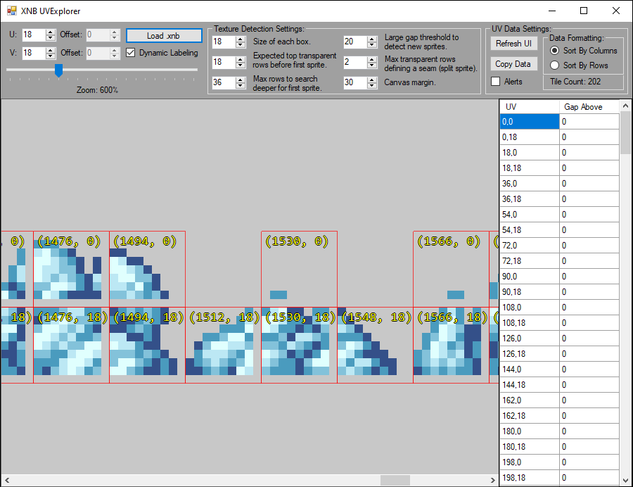

# XNB UV Explorer 🖼️

A lightweight WinForms tool for **inspecting & slicing XNB texture sheets**.  
(ideal for Terraria modding or any XNA/MonoGame asset work).

<p align="center">
  
</p>

---

## ✨ Features
| Category | What it does |
|----------|--------------|
| **Tile detection** | Auto-scans a texture, finds 18 × 18 tiles (configurable), draws red rectangles, lists UVs in a grid |
| **Grid mode** | Uniform grid overlay with user-defined offsets `<U, V>` |
| **Dynamic mode** | Per-column seam detection, split-sprite handling, row/column sort toggle |
| **Jump‑to UV** | **Double‑click any row** in the UV grid — the panel scrolls to that tile and flashes a lime dashed outline |
| **Data export** | One-click “Copy Grid” → clipboard (tab-delimited, header included) |
| **Zoom & pan** | 10 % – 500 % zoom, scroll-wheel + scrollbars |
| **Quality of life** | Live tile count, toastr-style alerts, embed-DLL resolver for single-file deployment |

---

## 🛠️ Prerequisites
* **Windows** (x86 / x64)
* **XNA Framework Redistributable 4.0**
* **.NET Framework 4.8** or newer  
  *(for build-from-source: Visual Studio 2019+ / `dotnet msbuild`)*

---

## 🚀 Getting started

```bash
git clone https://github.com/RussDev7/XNB-UVExplorer.git
cd XNBUVExplorer
XNBUVExplorer.exe           # If you downloaded a release zip
# or
msbuild XNBUVExplorer.sln   # Build from source → bin\Release\XNBUVExplorer.exe
```

1. **Load** – Click **`Load XNB`** and choose a `.xnb` file that contains a `Texture2D`.
2. **Inspect** – Red rectangles appear; UVs + gap info fill the lower grid.
3. **Jump** – Double‑click any UV row to centre & flash‑highlight that tile in the preview.
4. **Toggle** –  
   *Dynamic Labeling* ✔ = auto‑detect mode  
   *Dynamic Labeling* ✖ = uniform grid (adjust **Tile U/V, U‑Offset, V‑Offset**).
5. **Copy data** – Hit **Copy Grid**, paste directly into Excel.
6. **Refresh** – Tweak thresholds (tile size, seam gap, etc.) and press **Refresh UI**.

---

## ⚙️ Controls reference

| Control | Purpose |
|---------|---------|
| **Tile U / Tile V** | Width & height of each cell (px) |
| **U‑Offset / V‑Offset** | Shift the origin of the uniform grid |
| **Zoom slider** | 10 % to 500 % (label updates live) |
| **Dynamic Labeling** | On = run detection logic, Off = draw fixed grid |
| **Column / Row sorting** | Change UV listing order in the DataGridView |
| **Initial / Gap / Seam thresholds** | Fine‑tune sprite‑sheet quirks |
| **Double‑click UV row** | Jump to that tile in the preview and flash‑highlight |
| **Copy Grid** | Clipboard export (tab‑delimited) |
| **Alerts** | Enable message‑boxes after key actions |

---

## 🔍 Why another XNB viewer?

Most existing tools show the raw image only.  
**XNB UVExplorer** adds *programmable grid logic* (gap searching, seam fixes, offsets) so modders can quickly grab exact UVs without hopping into Photoshop – and now, instant navigation from UV list to image.

---

## 📸 Screenshots

```
docs/
  screenshot.png
  seam-demo.gif
```

---

## 📝 Roadmap / TODO

- [ ] Drag‑and‑drop XNB onto the window  
- [ ] JSON export of UV list  
- [ ] Animation preview for sprite sheets  
- [ ] Rewrite detection core for arbitrary tile sizes

Contributions welcome! Open an issue or a PR.

---

## 🤝 License

GPL © 2025 RussDev7  
See [`LICENSE`](LICENSE) for details.
